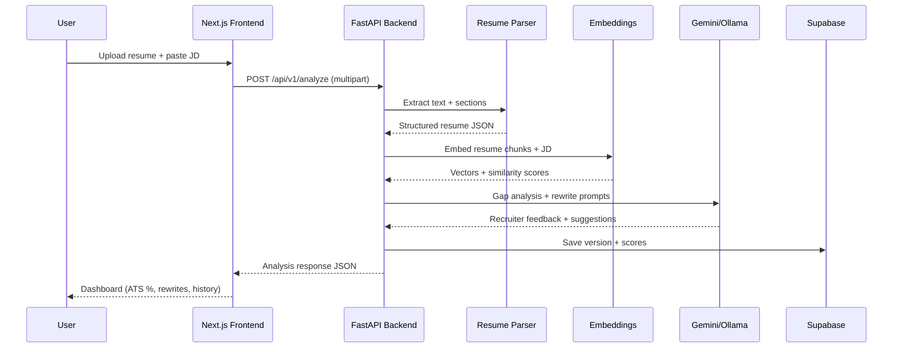

# AI Resume Optimization Agent — System Architecture

## What This System Does

Users upload a **resume** (PDF or DOCX) and paste a **job description**. The agent:

1. Extracts and structures resume text
2. Analyzes the job description
3. Compares them semantically (embeddings, not naive keyword lists)
4. Produces ATS scores, gap analysis, and recruiter-style feedback
5. Suggests human-sounding bullet rewrites
6. Tracks versions and improvement over time

---

## High-Level Architecture

```
┌─────────────────────────────────────────────────────────────────────────┐
│                         USER (Browser)                                   │
└─────────────────────────────────────────────────────────────────────────┘
                                    │
                                    ▼
┌─────────────────────────────────────────────────────────────────────────┐
│  FRONTEND — Next.js + Tailwind (Vercel)                                  │
│  • Upload resume (PDF/DOCX)                                              │
│  • Paste job description                                                 │
│  • Dashboard: scores, gaps, rewrites, history                            │
└─────────────────────────────────────────────────────────────────────────┘
                                    │ HTTPS / REST
                                    ▼
┌─────────────────────────────────────────────────────────────────────────┐
│  BACKEND — FastAPI (Render / Railway)                                    │
│  ┌─────────────┐  ┌──────────────┐  ┌─────────────┐  ┌──────────────┐  │
│  │ API Routes  │→ │ Services     │→ │ AI Layer    │→ │ Embeddings   │  │
│  │ (upload,    │  │ (parse,      │  │ (Gemini /   │  │ (MiniLM-L6)  │  │
│  │  analyze)   │  │  score,      │  │  Ollama)    │  │              │  │
│  └─────────────┘  │  rewrite)    │  └─────────────┘  └──────────────┘  │
│                   └──────────────┘                                       │
└─────────────────────────────────────────────────────────────────────────┘
                                    │
                                    ▼
┌─────────────────────────────────────────────────────────────────────────┐
│  DATABASE — Supabase (PostgreSQL + Storage)                              │
│  • users / sessions (optional Phase 5)                                   │
│  • resume_versions, analyses, scores, suggestions                        │
│  • file storage for uploaded resumes                                     │
└─────────────────────────────────────────────────────────────────────────┘
```

---

## Request Flow (End-to-End)



---

## Backend Layers (Modular)

| Layer | Responsibility | Phase |
|-------|----------------|-------|
| `api/routes/` | HTTP endpoints, validation, CORS | 1–5 |
| `models/schemas.py` | Pydantic request/response contracts | 1–5 |
| `services/resume_parser.py` | PDF/DOCX → clean text + sections | 1 |
| `services/jd_analyzer.py` | JD requirements extraction | 2 |
| `services/embeddings.py` | MiniLM vectors + cosine similarity | 2 |
| `services/ats_scorer.py` | Composite ATS + sub-scores | 2 |
| `services/ai_analyzer.py` | LLM prompts for gaps + tone | 3 |
| `services/rewrite_engine.py` | Before/after bullet suggestions | 3 |
| `services/comparison.py` | Old vs new resume delta | 4 |
| `db/supabase_client.py` | Persistence | 4–5 |

---

## ATS Scoring Logic (Phase 2+)

**Not** simple keyword counting. Composite score:

```
ATS Match = weighted average of:
  • Semantic similarity (embeddings)     — 40%
  • Skills overlap (semantic + explicit) — 25%
  • Experience relevance                 — 20%
  • Keyword coverage (soft, capped)      — 15%
```

Sub-scores exposed separately: Skills Match, Experience Match, Keyword Match.

---

## AI Behavior Rules (Phase 3)

- Recruiter voice: specific, actionable, no fluff
- No fabricated metrics or fake job titles
- Rewrites preserve truth; only reframe existing work
- No keyword stuffing; natural professional tone
- Every suggestion includes **reason** (why it helps for this JD)

---

## Security (Production)

- Validate file type + size server-side
- Never log full resume text in production
- API keys only in backend `.env`
- CORS restricted to frontend origin
- Rate limiting on analyze endpoint (Phase 5)
- Supabase RLS when auth is added

---

## Deployment Targets

| Component | Platform | Cost |
|-----------|----------|------|
| Frontend | Vercel | Free tier |
| Backend | Render or Railway | Free tier |
| Database | Supabase | Free tier |
| LLM | Gemini API free tier OR Ollama local | Free |
| Embeddings | sentence-transformers (local CPU) | Free |

---

## Build Phases Roadmap

| Phase | Deliverables |
|-------|----------------|
| **1** (now) | Monorepo, FastAPI upload + parse, Next.js upload UI |
| **2** | JD analysis, embeddings, ATS scoring API |
| **3** | Gemini/Ollama rewrite engine + prompts |
| **4** | Supabase schema, version history, comparison |
| **5** | UI polish, deploy, rate limits, monitoring |

---

## Tech Choices — Why

- **FastAPI**: Fast, typed, great for ML/AI pipelines in Python
- **Next.js**: SEO-friendly marketing later; App Router for clean UI
- **Supabase**: Postgres + storage without managing infra
- **MiniLM-L6-v2**: Small, fast, good enough semantic match on CPU
- **PyMuPDF + python-docx**: Reliable free parsing vs paid APIs
